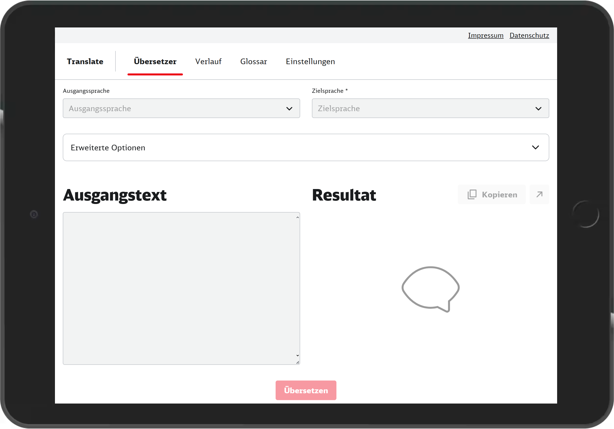

<h1 align=center>ng-translate</h1>

🔤 A frontend for the DeepL translation API

 

This project was built to circumvent the per-translation character limit of the DeepL free plan (which doesn't apply to the free API plan), experiment with the DB UI design system and try out some features of modern Angular.

## Development server

Run `yarn start` for a dev server. Navigate to `http://localhost:4200/`. The application will automatically reload if you change any of the source files.

Run `caddy run .` to start the proxy server that's necessary to connect to the DeepL API.

## Build

Run `yarn build` to build the project. The build artifacts will be stored in the `dist/` directory.

## Deploy

You can use the provided Dockerfile to build a deployable image, based on Caddy Webserver. The provided Caddyfile takes care of proxying API requests to the right DeepL API endpoint.
